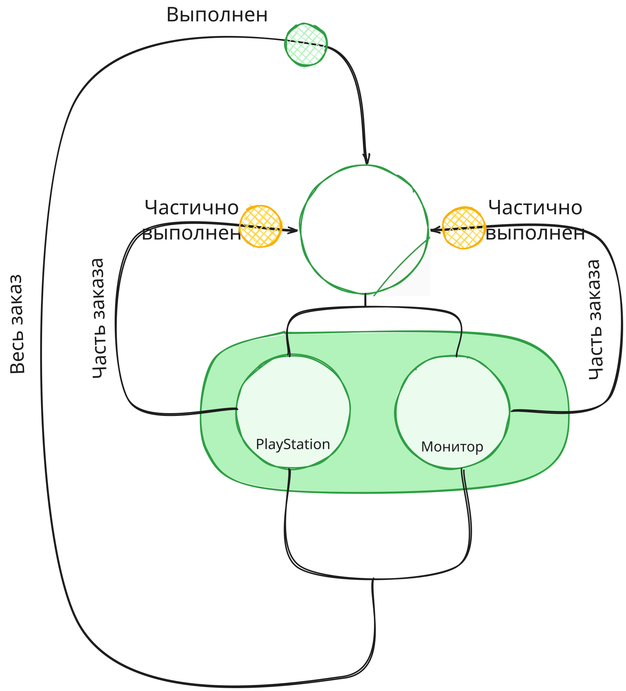
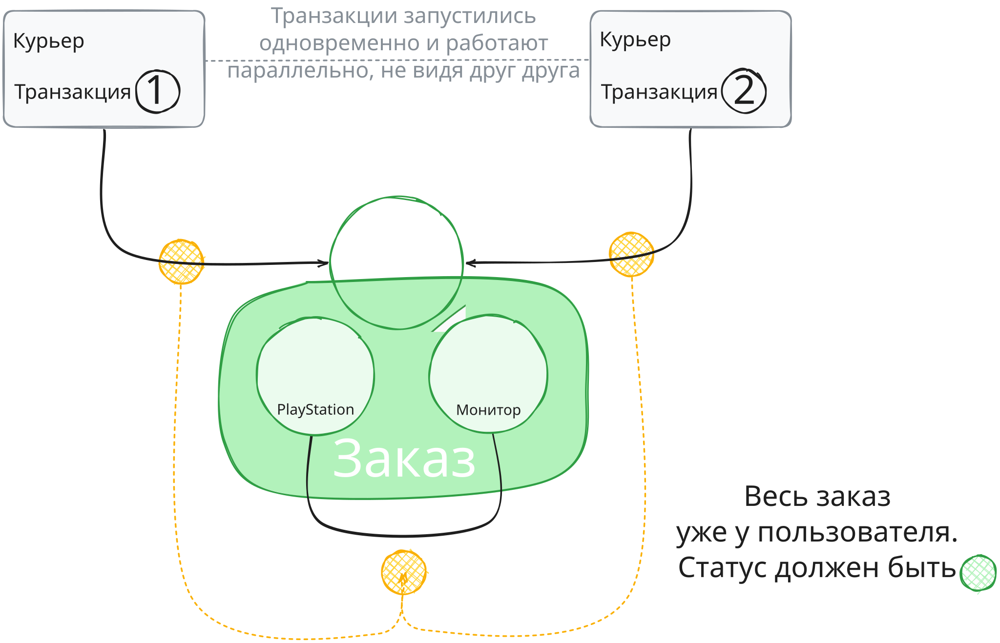
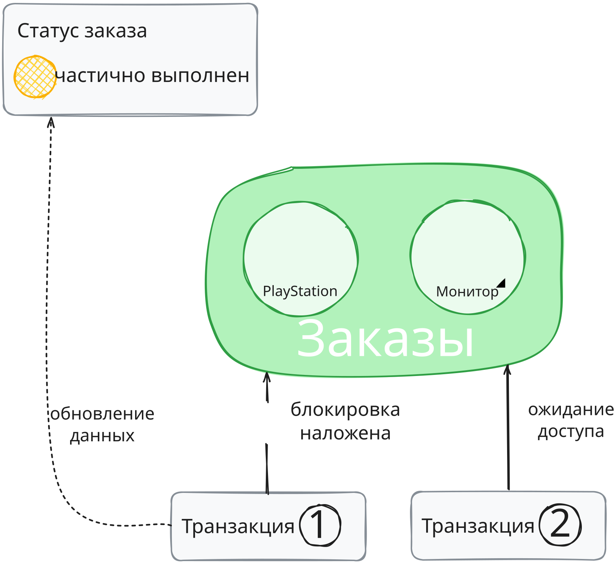
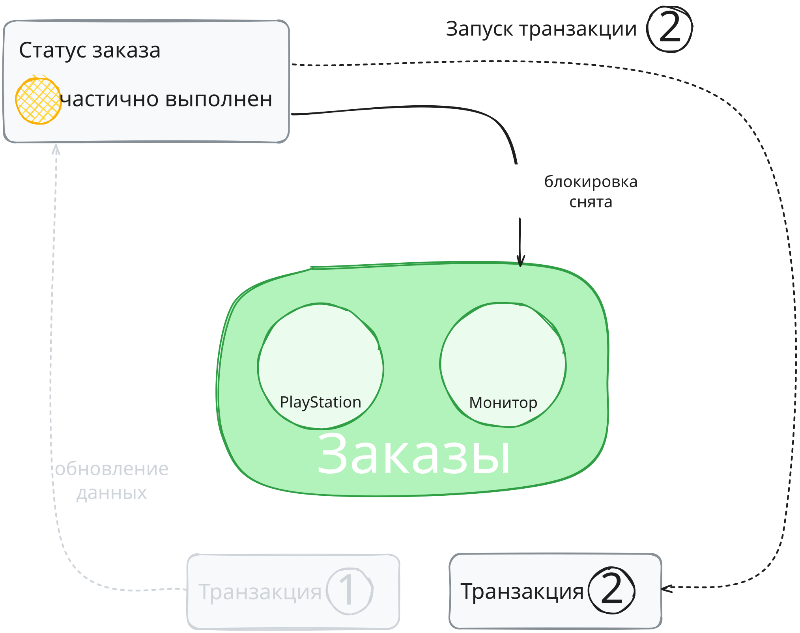
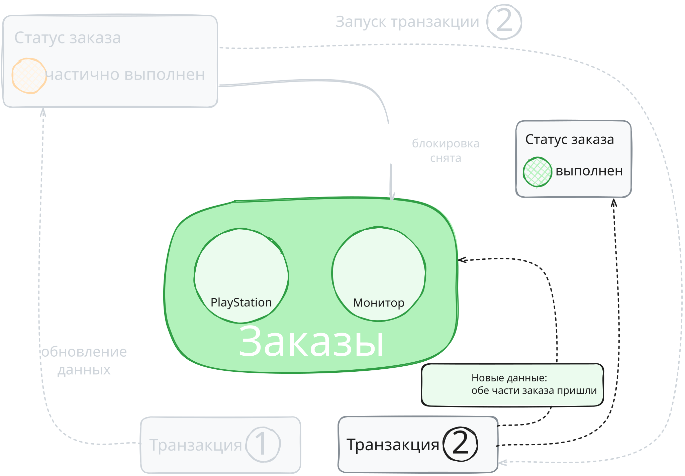

# Блокировки

В прошлых уроках вы узнали как изоляция помогает поддерживать целостность данных, предотвращая аномалии чтения.
Также вы познакомились с MVCC (многоверсионным управлением конкурентным доступом) - механизмом,
который PostgreSQL использует для управления одновременно запущенными транзакциями и поддержки
уровней изоляции транзакций.

На практике бывает, что использовать только MVCC неудобно или приводит к высоким издержкам.
Разберём такую ситуацию на примере.

Пользователь сделал заказ в онлайн-магазине - купил PlayStation и монитор. Оба товара оформлены в один заказ.
Когда один из товаров придёт к пользователю, заказ получит статус «Частично выполнен».
Когда пользователь заберёт все товары из заказа, он получит статус «Выполнен».

К пользователю приезжает курьер с PlayStation - запускается транзакция 1,
чтобы обновить статус заказа на «Частично выполнен».
Почти в то же время приезжает второй курьер с монитором - запускается транзакция 2 с той же целью.

Если обе транзакции работают параллельно и не учитывают изменения, внесённые друг другом, они могут обе установить 
статус заказа «Частично выполнен». Обе транзакции не увидят, что другой товар уже пришёл,
поскольку обе начинают работать со статуса заказа, который был на момент старта транзакции.
В результате у заказа будет статус «Частично выполнен», хотя все товары уже прибыли.

Чтобы избежать такой проблемы, можно было бы использовать уровень изоляции `SERIALIZABLE` - потому что он гарантирует,
что транзакции будут выполняться так, будто они запустились последовательно. Однако есть нюансы:

* `SERIALIZABLE` не гарантирует определённую последовательность выполнения,
порядок определяется СУБД, и он непредсказуем;
* Если СУБД обнаружит потенциальный конфликт при попытке завершения `SERIALIZABLE`-транзакции,
она просто отменит транзакцию, а это может привести к повышенному количеству откатов транзакций.
Поэтому, используя `SERIALIZABLE`, пришлось бы добавить обработку откатов
транзакции в случае ошибок сериализации и повторный запуск этих транзакций.
Это усложняет код и снижает эффективность работы приложения из-за постоянных ошибок и перезапусков транзакций.

В таких ситуациях, когда MVCC оказывается недостаточно или он не даст желаемый результат, применяют блокировки.

**Блокировки** - это механизм, который позволяет транзакции «заморозить» определённые данные (ресурсы),
так что их нельзя читать или изменять другим транзакциям до завершения текущей транзакции. 

> Мы будем говорить «изменить», так как чаще всего блокируется только изменение ресурсов, но подразумевается,
> что в некоторых случаях блокируется и чтение.
> 
> Здесь и дальше в уроках термин «ресурс» будем использовать для определения любой единицы данных,
> с которой может взаимодействовать процесс или транзакция: строки в таблице, самой таблицы или всей БД.

Блокировки ограничивают доступ к определённым данным во время выполнения транзакции.
Ещё это называют **захватом ресурсов**. 
Когда транзакция блокирует данные,
другие транзакции не могут менять или читать - в зависимости от вида блокировки - эти данные до тех пор,
пока блокировку не снимут. Это называется **освобождением блокировки**.

В примере с пользователем и гаджетами при выполнении транзакции 1
нужно поставить блокировку на таблицу со статусами заказов, чтобы у транзакции 2 не было к ней доступа
и она перешла в режим ожидания.

После того как транзакция 1 обновить таблицу заказов и поставит статус «Частично выполнен»,
блокировка с таблицы снимается. Транзакция 2 запустится и увидит, что один товар из заказа уже пришел,
а второй пришел сейчас - значит надо поставить статус «Выполнен».

**Шаг 1: Запускаем транзакцию 1 и блокируем данные**

**Шаг 2: Снимаем блокировку и запускаем транзакцию 2**

**Шаг 3: Завершаем транзакцию 2 и устанавливаем корректный статус заказа**

## Категории блокировок

Аналогично транзакциям, которые могут быть явным и неявными, блокировки тоже делятся на две категории:

* **Автоматические** - СУБД устанавливает и снимает их автоматически по мере необходимости,
обеспечивая так надлежащее взаимодействие с данными;
* **Явные, или управляемые** - разработчик устанавливает их вручную в коде приложения.
Поэтому ответственность за правильное управление блокировками, включая их совместное снятие - на разработчике.
Как правило, разработчик использует явные блокировки для предотвращения конфликтов
при обновлении данных и для обеспечения консистентности данных.

Вот некоторые ситуации, в которых использование явных блокировок может быть оправданным.

**Сложные транзакции из нескольких операций.**
Если в одной транзакции нужно выполнить несколько операций как единое целое, блокировки гарантируют, 
что другие транзакции не изменять данные во время выполнения этих операций.

Например, нужно собрать заказ из товаров с разных складов, но количества товара на одном складе может быть недостаточно,
и придётся «добирать» товар на других складах. При этом нужно учесть расстояние от складов,
чтобы предположить ближайший.

Сперва нужно посмотреть доступное количество товара на разных складах, применив блокировку на изменение.
Она гарантирует, что эта информация не изменится, пока система решает, с каких складов забирать товар.
Пока товар забирается со склада, блокировка сохраняется, чтобы другая операция не поменяла количество товара на складе.

**Сценарий с зависимостями между данными.**
Если одна операция зависит от результатов другой операции, блокировки можно использовать,
чтобы обеспечить согласованность выполнения этих операций.

Например, есть онлайн-маркетплейс, который действует как посредник между поставщиками и клиентами.
Бизнес-логка предполагает две связанные операции: покупку товара у поставщика
и последующую продажу этого товара клиенту. Эти операции должны выполняться последовательно и согласованно - нужно
избежать ситуации, когда товар уже продан клиенту, а покупка у поставщика ещё не завершена. 

Обеспечить согласованное выполнение этих операций помогут блокировки.
При этом блокировка будет применяться к определённым данным,
чтобы предотвратить их изменение во время выполнения операции.

Примерны сценарий такой:
1. Пришел заказ от клиента на определённый товар;
2. Перед тем как продать товар клиенту, его нужно закупить у поставщика. Запускается процесс закупки;
3. Во время закупки применяется блокировка к данным о товаре у поставщика,
чтобы другие операции не могли изменять эту информацию, и никто не мог купить этот товар;
4. Закупка состоялась, товар получен от поставщика;
5. Товар продаётся клиенту. Во время продажи также применяется блокировка к данным о товаре,
чтобы обеспечить согласованность между продажей и закупкой.

Пример с пользователем и заказом подходит под сценарий зависимостей между данными,
так как статус «Частично выполнен» и «Выполнен» проставляется в зависимости от того,
сколько товаров доставлено на текущий момент.

**Управление доступом к ресурсам.**
Если важно проконтролировать, какие транзакции могут получить доступ к определённому ресурсу в заданное время.

Например, бронирование билетов или номер в отеле. В случаях, когда есть риск получить множественные запросы
на последний доступный билет или номер, можно применить блокировку, чтобы предотвратить отмену транзакции,
если кто-то другой успевает купить билет раньше.